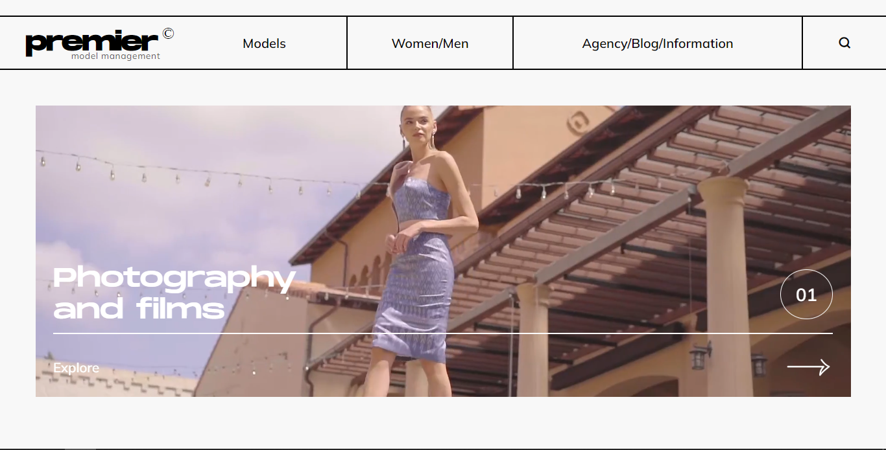

# Premier - Model Management Website

Welcome to Premier, the Model Management Website project! This is a static website created with HTML and CSS, designed for managing and showcasing models and their portfolios.



## Table of Contents

- [Overview](#overview)
- [Demo](#demo)
- [Features](#features)
- [Updates](#updates)
- [Installation](#installation)
- [Contributing](#contributing)
- [Acknowledgements](#acknowledgements)
- [License](#license)

## Overview

Premier is a Model Management Website that provides a platform for managing and displaying model portfolios. It is designed to be visually appealing and user-friendly, facilitating seamless navigation for both models and potential clients.

## Demo

Explore the live demo of the Premier Model Management Website: [Live Demo]([https://your-demo-url.com](https://antra77.github.io/Model-Website/))

## Features

- **Model Portfolios:** Showcase detailed portfolios for each model, including images, bio, and statistics.
- **Responsive Design:** Ensures a consistent and engaging experience across different devices.
- **Updates:** Showcases information about upcoming events.
- **Blog Page:** Showcases special features.
- **CSS Styling:** Modern and clean design using CSS for an attractive user interface.

## Installation

To run the Premier Model Management Website locally, follow these steps:

1. Clone the repository:

   ```bash
   git clone https://github.com/your-username/premier-model-management.git
   cd premier-model-management
   ```

2. Open the `index.html` file in your preferred web browser.

## Contributing

Contributions to enhance the Premier Model Management Website are welcome! If you have suggestions, find a bug, or want to add new features, please follow the [contribution guidelines](CONTRIBUTING.md).

1. Fork the repository.
2. Create a new branch (`git checkout -b feature/your-feature`).
3. Make changes and commit them (`git commit -am 'Add some feature'`).
4. Push to the branch (`git push origin feature/your-feature`).
5. Create a new pull request.

## Acknowledgements

I would like to express my appreciation to Unsplash for providing high-quality, royalty-free images that have been used in this model management website.

## License
This project is licensed under the [MIT License](LICENSE).
Feel free to adapt and customize this template based on your project's specific details. Happy modeling! 🌟📸
